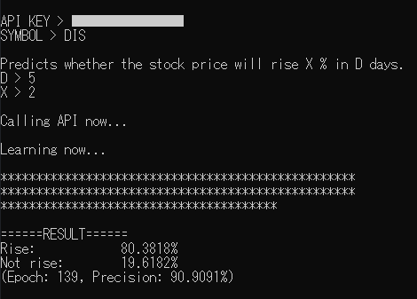

# StockPredictor



## Overview

- 米国株式・ETFの短期間の株価変動率を予測します。

- 株価情報は[Alpha Vantage](https://www.alphavantage.co/)を利用して取得しています。

- 本ソフトウェアでは[こちら](https://www.alphavantage.co/support/#api-key)で無料で取得できるAPIキーを使用します(demoキーを使ったお試し利用も可能です)。

- 本ソフトウェアによって算出される値はあくまで目安です。

## Usage

「StockPredictor.exe」を起動してください。

Alpha VantageのAPIキー、予測したい銘柄のシンボル、期間(1～30日)、基準となる変動率(1～100%)を入力してください。なお、APIキーに「demo」と指定すると自動的にシンボルは「IBM」に指定されます。

以下の例ではGoogleの株価が5日後4%上昇するかどうかを予測しています。

Example:
```
API > XXXXXXXXXXXXXXXX(Your API key)
SYMBOL > GOOGL

Predicts whether the stock price will rise X % in D days.
D > 5
X > 4
```

しばらくすると予測結果と予測精度が表示されます。

## Description

- 2値分類ニューラルネットワークを使用し、指定した期間後(1～30日)に指定した割合(1～100%)の変動があるかないかを予測します。

- APIから過去300日分(休場日は除く)の日足データと14日ATRデータを取得し、うち約3/4を利用して学習しています(残りの1/4はテストデータとして使用)。ニューラルネットワークの説明変数には当日と前日の変動率、当日と前日の10日モメンタム、14日ATRの5つを使用しています。

- なお、指定したパラメータによっては十分な学習データを得られず、学習に失敗することもあります。その際はパラメータを変更して再度予測を行ってください。

## Reference

- 斎藤康毅「ゼロから作るDeep Learning - Pythonで学ぶディープラーニングの理論と実装」, オライリー・ジャパン, 2020

- [C言語でニューラルネットワークの実装](https://qiita.com/tky823/items/ffc367e52c4a04cffa1d)

- [c++を用いたニューラルネットワーク(アヤメ)](https://qiita.com/iamwizone/items/c6f2774a747932dff162)

## Licence

本ソースコードでは[curl](https://curl.se/)、[JSON for Modern C++](https://github.com/nlohmann/json)を使用しています。詳しいライセンスについては以下をご覧ください。

[LICENSES](https://github.com/mthr11/StockPredictor/tree/master/LICENSES)

---

The class contains the UTF-8 Decoder from Bjoern Hoehrmann which is licensed under the MIT License (see above). Copyright © 2008-2009 Björn Hoehrmann bjoern@hoehrmann.de

The class contains a slightly modified version of the Grisu2 algorithm from Florian Loitsch which is licensed under the MIT License (see above). Copyright © 2009 Florian Loitsch

The class contains a copy of Hedley from Evan Nemerson which is licensed as CC0-1.0.

The class contains parts of Google Abseil which is licensed under the Apache 2.0 License.
